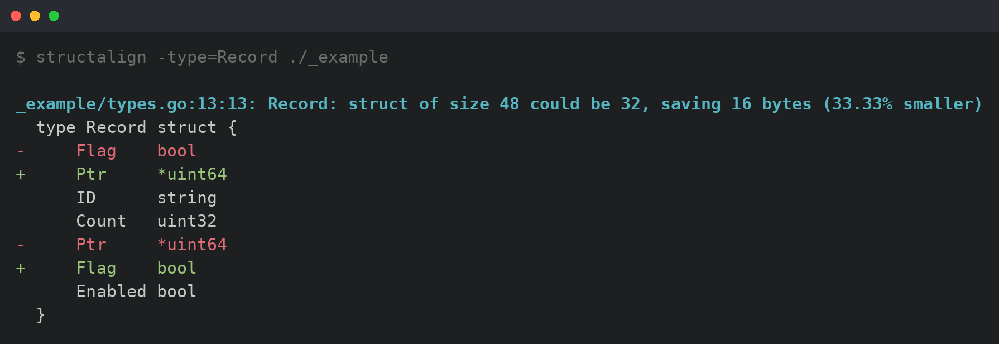

# structalign

[](https://github.com/peczenyj/structalign/releases)

[](http://pkg.go.dev/github.com/peczenyj/structalign)
[](https://github.com/peczenyj/structalign/actions/workflows/ci.yml)
[](https://codecov.io/gh/peczenyj/structalign)
[](https://goreportcard.com/report/github.com/peczenyj/structalign)
[](https://github.com/peczenyj/structalign/actions/workflows/github-code-scanning/codeql)
[](https://github.com/peczenyj/structalign/actions/workflows/dependency-review.yml)
[](./LICENSE)
[](https://github.com/peczenyj/structalign/releases/latest)
[](https://github.com/peczenyj/structalign/releases/latest)
[](https://github.com/peczenyj/structalign/commit/HEAD)
[](https://github.com/peczenyj/structalign/blob/main/CONTRIBUTING.md#pull-request-process)
[](https://github.com/peczenyj/structalign/attestations)
[](https://github.com/avelino/awesome-go#code-analysis)

> See how reordering a Go struct's fields could save memory — as a **diff**, not a
> rewrite — plus a per-field **layout inspector**.

A read-only companion to `golang.org/x/tools`'s `fieldalignment`: it shows the
memory-optimal struct as a unified or side-by-side diff instead of silently
rewriting your files, and can also print any struct's offset/size/align/padding
layout. The analysis comes straight from the upstream analyzer, so results match
`fieldalignment` exactly — only the presentation is new.

<p align="center">
  
</p>

## Quick start

Install:

```sh
go install github.com/peczenyj/structalign@latest
```

Or grab a prebuilt binary for your OS/arch from the
[Releases](https://github.com/peczenyj/structalign/releases) page. Check the
installed version with `structalign -version`.

Then point it at a file, a package, or any Go package pattern:

```sh
structalign ./...            # every package in the module
```

It accepts whatever the `go` tool does — `./...`, import paths, directories, and
single `.go` files — and you can pass several at once. By default it skips
**generated files** (`// Code generated … DO NOT EDIT.`) and `_test.go` files; use
`-generated` / `-tests` to include them (see [Scanning scope](#scanning-scope)).

Pointed at the bundled sample (`./_example`), it reports the reordering and exits
non-zero so it can gate CI:

```
$ structalign -type=Mixed ./_example
_example/types.go:6:12: Mixed: struct of size 24 could be 16 (33.33% smaller)
  type Mixed struct {
+ 	B int64
  	A bool
- 	B int64
  	C bool
  }
$ echo $?
1
```

## Why it exists

`golang.org/x/tools/.../fieldalignment` has exactly two modes:

- **report** — prints a terse message like `struct of size 24 could be 16` and nothing else;
- **`-fix`** — silently rewrites your source.

There is no "show me the proposed struct / show me the diff" mode, and no way to
inspect a struct's layout. `structalign` fills both gaps.

| | report a problem | show the diff | rewrite files | inspect layout | CI-friendly exit code |
|---|:---:|:---:|:---:|:---:|:---:|
| `fieldalignment`        | ✅ | ❌ | ❌ | ❌ | ✅ |
| `fieldalignment -fix`   | ❌ | ❌ | ✅ | ❌ | ❌ |
| `structlayout`          | ❌ | ❌ | ❌ | ✅ | ❌ |
| **structalign**         | ✅ | ✅ | ❌ | ✅ | ✅ |

## Usage

```
structalign [flags] [packages]

  packages        Go package patterns: ./..., import paths, directories, or
                  single .go files (defaults the go tool understands)

  -diff value     diff style: unified|side|none       (default "unified")
  -width int      column width per side for -diff=side (default: auto from terminal)
  -color value    colorize: auto|always|never         (default "auto")
  -inspect        inspect layout instead of diffing: print each struct as
                  annotated Go source with size/align/padding comments
  -verbose        in -inspect mode, show padding on its own `_` line
  -tags           preserve struct field tags in output (default: strip them)
  -summary        in diff mode, print a one-line summary after the diffs

  -type string    only consider named structs matching these comma-separated
                  glob patterns (e.g. "*Request,Config"); empty means all
  -exclude string exclude packages whose import path matches this regexp
                  (default "^unsafe$|^builtin$")
  -generated      also analyze generated files (skipped by default)
  -tests          also analyze _test.go files (skipped by default)
  -skip-cache-padded
                  skip structs with a golang.org/x/sys/cpu.CacheLinePad field

  -version        print version and exit
```

In the default `-color=auto`, color is emitted only when stdout is a terminal and
the [`NO_COLOR`](https://no-color.org) environment variable is unset. `NO_COLOR`
(any non-empty value) disables color; an explicit `-color=always` overrides it.

Exit code is **1 when reorderings are found**, **0 when none** — so it drops into
CI as a check. Inspect mode is informational and always exits 0.

## Modes

### Diff (default)

Unified diff:

```
$ structalign -type=Mixed ./_example
_example/types.go:6:12: Mixed: struct of size 24 could be 16 (33.33% smaller)
  type Mixed struct {
+ 	B int64
  	A bool
- 	B int64
  	C bool
  }
```

Side-by-side:

```
$ structalign -diff=side -width=28 -type=Mixed ./_example
_example/types.go:6:12: Mixed: struct of size 24 could be 16 (33.33% smaller)
  current                      │ proposed
  ─────────────────────────────┼─────────────────────────────
  type Mixed struct {          │ type Mixed struct {
                               │     B int64
      A bool                   │     A bool
      B int64                  │
      C bool                   │     C bool
  }                            │ }
```

Print the reordered struct only (no diff): `structalign -diff=none ./_example`.

With `-summary`, a one-line aggregate is appended after the diffs (counting only
the structs shown, and the bytes their reorderings would save):

```
$ structalign -summary ./_example
... (diffs above) ...
Summary: 5 structs affected, 56 bytes saved
```

### Inspect layout

`-inspect` skips the alignment analyzer entirely and prints each (filtered) named
struct as annotated Go source: the declaration with per-field `// size: N, align: M`
comments, column-aligned, plus a size/align/padding summary on the opening line.
Padding is folded onto the field comment by default:

```
$ structalign -inspect -type=Mixed ./_example
type Mixed struct { // size: 24, align: 8, padding: 14
	A bool  // size:  1, align: 1, padding: 7
	B int64 // size:  8, align: 8
	C bool  // size:  1, align: 1, padding: 7
}
```

With `-verbose`, padding moves onto its own `_` line:

```
$ structalign -inspect -verbose -type=Mixed ./_example
type Mixed struct { // size: 24, align: 8, padding: 14
	A bool  // size:  1, align: 1
	_       // 7 byte padding
	B int64 // size:  8, align: 8
	C bool  // size:  1, align: 1
	_       // 7 byte padding
}
```

The layout comes from the same `go/types` sizing the diff modes use
(`types.Sizes.Offsetsof` / `Sizeof` / `Alignof`), driven by the toolchain's
target sizes (your host `GOOS`/`GOARCH` by default). This is similar to
`honnef.co/go/tools/cmd/structlayout`, but stays inside
this one tool and honors the same `-type` filter.

#### Inspecting generic types

A generic struct has **no single layout** — `type Box[T any] struct{ … }` is laid
out differently for every type argument (`Box[bool]` and `Box[[64]byte]` share
nothing), so there is no concrete type to measure. Inspect therefore shows a
**best-effort approximation**: each type parameter is measured as a representative
type — its constraint's core type (e.g. `~int` → `int`), or `interface{}` when the
constraint is unbounded (`any`, `comparable`, unions). Fields keep their source
form (`Value T`, not `Value any`), and every field whose size depends on a type
parameter is annotated with the assumption it was measured under (`-- assume
T=any`). The output is also prefixed with a disclaimer. Treat the numbers as
indicative only; the real layout depends on how the type is instantiated.

```
$ structalign -inspect -type=Generic ./_example
// generic type — layout assumes T=any; the real layout depends on the type argument(s)
type Generic[T] struct { // size: 32, align: 8, padding: 11
	Flag bool    // size:  1, align: 1, padding: 7
	Value T      // size: 16, align: 8               -- assume T=any
	Count uint32 // size:  4, align: 4, padding: 4
}
```

A field can depend on a type parameter indirectly — through a composite or a
nested generic — and the marker follows it: `map[K]V` reports `-- assume K=any,
V=any`, and `Inner[V]` reports `-- assume V=any`.

#### Inspecting types you don't own

structalign resolves its package arguments through `go/packages`, so you can
point `-inspect` (and the diff modes) at types you didn't write — as long as the
package is reachable from the **current directory's `go.mod`**.

Standard-library structs work out of the box — give the import path and a
`-type` filter:

```
$ structalign -inspect -type=Time time
type Time struct { // size: 24, align: 8, padding: 0
	wall uint64   // size:  8, align: 8
	ext int64     // size:  8, align: 8
	loc *Location // size:  8, align: 8
}
```

Dependencies already in your `go.mod` resolve the same way:

```
$ structalign -inspect -type=Group golang.org/x/sync/errgroup
type Group struct { // size: 64, align: 8, padding: 4
	cancel func(error) // size:  8, align: 8
	wg sync.WaitGroup  // size: 16, align: 8
	sem chan token     // size:  8, align: 8
	errOnce sync.Once  // size: 12, align: 4, padding: 4
	err error          // size: 16, align: 8
}
```

Any other library must be *required* by the module you run in — resolution is
against the current `go.mod`, **not** arbitrary packages sitting in `$GOPATH` or
the module cache. A package the module doesn't require fails with `no required
module provides package …`. The quickest way to inspect an arbitrary library is
a throwaway module:

```sh
mkdir /tmp/inspect && cd /tmp/inspect
go mod init scratch
go get github.com/rs/zerolog
structalign -inspect -type=Logger github.com/rs/zerolog
```

Built-in **scalar** types (`int`, `bool`, `string`, …) can't be inspected:
inspect prints a *struct field layout*, and scalars have no fields. (The
`builtin` pseudo-package is in the default `-exclude` for the same reason.) To
see a scalar's size, inspect a struct that contains it — a `string` field shows
`size: 16` on a 64-bit target.

### Filtering by type name

`-type` takes a comma-separated list of glob patterns (`path.Match` syntax: `*`,
`?`, `[...]`) matched against the *declared* name of each struct type. Anonymous
structs and struct literals are never matched by a non-empty filter. It applies to
every mode:

```sh
structalign -type='*Request' ./...          # only structs ending in Request
structalign -type='Record,Config' ./pkg     # exact names
structalign -inspect -type='*ID*' ./pkg     # inspect just ID-related structs
```

### Scanning scope

By default structalign analyzes the regular, hand-written source of each package.
A few flags adjust what's in scope:

```sh
structalign -generated ./...                 # include generated files (skipped by default)
structalign -tests ./...                     # include _test.go files (skipped by default)
structalign -exclude='/internal/' ./...      # drop packages whose import path matches the regexp
structalign -skip-cache-padded ./...         # skip structs guarded by cpu.CacheLinePad
```

- **Generated files** (`// Code generated … DO NOT EDIT.`) are skipped by default —
  you usually can't hand-edit them, so a reorder suggestion would be noise.
- **`_test.go` files** are skipped by default; `-tests` includes them.
- **`-exclude`** takes a regexp matched against the *import path* (default
  `^unsafe$|^builtin$`); it complements `-type`, which matches struct names.
- **`-skip-cache-padded`** leaves structs with a
  [`cpu.CacheLinePad`](https://pkg.go.dev/golang.org/x/sys/cpu#CacheLinePad) field
  alone, since reordering would move the pad and defeat its false-sharing guard.

### Field tags

By default the tool **strips struct field tags** from all output, so the focus
stays on field order and layout rather than tag text. This matters most in diff
mode: reordering changes column widths, which makes `gofmt` re-align tags, and
those re-spacing changes would otherwise show up as diff noise unrelated to the
actual reorder. Stripping tags from both sides removes that distraction.

Pass `-tags` to keep tags. In diff mode they stay bound to their fields as the
fields move; in inspect mode they are appended to each field declaration (with
comments still column-aligned):

```
$ structalign -inspect -tags -type=Tagged ./_example
type Tagged struct { // size: 48, align: 8, padding: 18
	Flag bool `json:"flag"`       // size:  1, align: 1, padding: 7
	ID string `json:"id" db:"id"` // size: 16, align: 8
	Count uint32 `json:"count"`   // size:  4, align: 4, padding: 4
	Ptr *uint64                   // size:  8, align: 8
	Enabled bool `json:"enabled"` // size:  1, align: 1, padding: 7
}
```

Tags never affect the layout numbers (size/offset/alignment are independent of
tags), so stripping them changes only the display, never the analysis.

## How it works

`structalign` does **not** reimplement the alignment algorithm. It runs the
**unmodified** `fieldalignment.Analyzer`, intercepts the `analysis.SuggestedFix`
it already produces (a single `TextEdit` replacing the whole struct node with the
optimally-ordered, gofmt'd version), and diffs that against your original source.
Because all the alignment logic — including the GC pointer-bytes optimization and
size calculations — comes straight from upstream, results match `fieldalignment`
exactly. Only the *presentation* is new.

## Building from source

Requires **Go 1.25+** (the floor set by `golang.org/x/tools`). The repo uses
[Task](https://taskfile.dev) ([`golangci-lint`](https://golangci-lint.run) handles
both linting and formatting); the `Makefile` just delegates to `task`.

```sh
git clone https://github.com/peczenyj/structalign
cd structalign
task build          # -> ./structalign   (or: go build -o structalign .)
task ci             # lint, build, test, and a smoke test against ./_example
task --list         # list all tasks
```

`main.go` (at the module root) is a thin entrypoint; the implementation lives in
small packages under `pkg/common` (contracts) and `internal/` (loader, align,
layout, ui, app, …). `_example/` holds sample structs for manual testing — the leading
underscore keeps the Go tool from treating it as a package, so it stays out of
`go build ./...` and friends.

## Caveats inherited from fieldalignment

- The most compact order is not always the most efficient — packing fields tightly
  can occasionally induce false sharing between goroutines. For deliberately
  cache-line-padded structs, use `-skip-cache-padded`.
- Reordering can hurt logical grouping/readability; treat the output as advice,
  most valuable for hot, frequently-allocated structs.
- Sizes are computed for the toolchain's target (your host `GOOS`/`GOARCH` by
  default). To analyze another target, set them in the environment, e.g.
  `GOARCH=386 structalign ./...`.
- For **generic** structs both modes work from the type parameters' assumed
  (constraint) sizes, so the result may not match a particular instantiation —
  diff may suggest a non-optimal order, and inspect's numbers are approximate (it
  prints a disclaimer; see [Inspecting generic types](#inspecting-generic-types)).

## Design notes

### Pipeline

1. Load the target packages with `golang.org/x/tools/go/packages` (mode
   including syntax, types, type info, and `TypesSizes`). This resolves `./...`,
   import paths, directories, and single files the way the `go` tool does, and
   supplies the analyzer's size math from the real build target.
2. Satisfy the analyzer's only dependency — the `inspect` pass — by building an
   `inspector.New(pkg.Syntax)` and placing it in `Pass.ResultOf`.
3. Provide a custom `Pass.Report` that captures each diagnostic's `NewText` (the
   proposed struct) and reads the original source slice between `Pos` and `End`.
4. Diff the two with `github.com/aymanbagabas/go-udiff` (a maintained standalone
   port of the Myers diff packages gopls uses, via `udiff.Lines`) and render the
   result as a unified or side-by-side diff, or just print the reordered struct.

### Dependencies and the internal-package rule

This tool lives in its own standalone module (`github.com/peczenyj/structalign`)
and pulls two dependencies as ordinary `go get`-able modules:

- `golang.org/x/tools` — for the public `.../passes/fieldalignment` analyzer.
- `github.com/aymanbagabas/go-udiff` — for line diffing.

Go's internal-package rule says a package may import `<prefix>/internal/...` only
if the **importing package's own path** is rooted at `<prefix>/`. That is why
diffing uses `go-udiff` rather than x/tools' own diff package:

- `fieldalignment` imports `golang.org/x/tools/internal/astutil` — fine, because
  the importer is itself under `golang.org/x/tools/`. This tool only touches
  `fieldalignment`'s public API, so importing the analyzer from any module works.
- `golang.org/x/tools/internal/diff`, by contrast, **cannot** be imported from
  `github.com/peczenyj/structalign` (not under `golang.org/x/tools/`), so the
  compiler rejects it. `go-udiff` is a public port of the same gopls diff code,
  so the results are equivalent.

## Changelog

See [CHANGELOG.md](CHANGELOG.md). Commits follow
[Conventional Commits](https://www.conventionalcommits.org), and the changelog is
generated from them with [git-cliff](https://git-cliff.org) in
[Keep a Changelog](https://keepachangelog.com) format:

```sh
task changelog                 # regenerate CHANGELOG.md
task changelog:unreleased      # preview pending entries
task release TAG=v0.1.0        # stamp the changelog for a release
```

## Contributing

See [CONTRIBUTING.md](CONTRIBUTING.md) for the development workflow, commit
conventions, and the release process.

## License

[MIT](LICENSE) © Tiago Peczenyj
